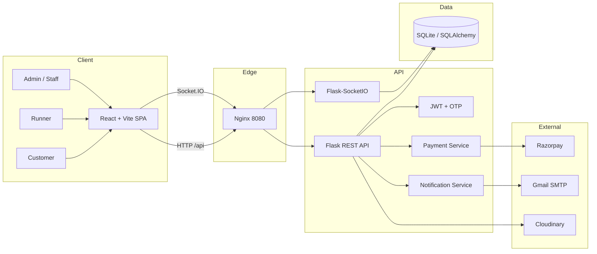
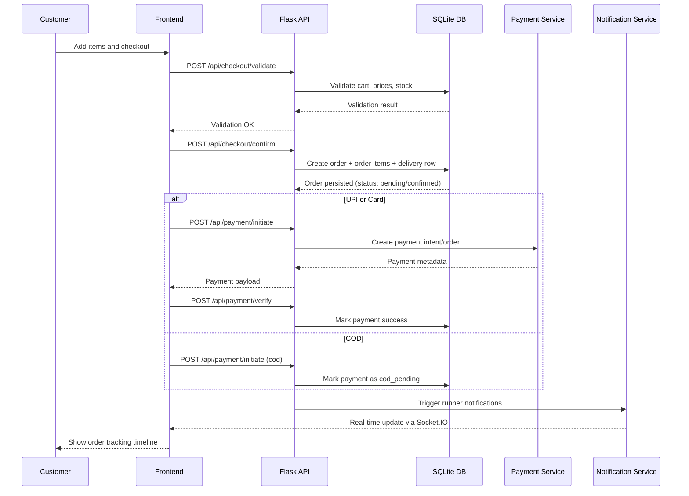
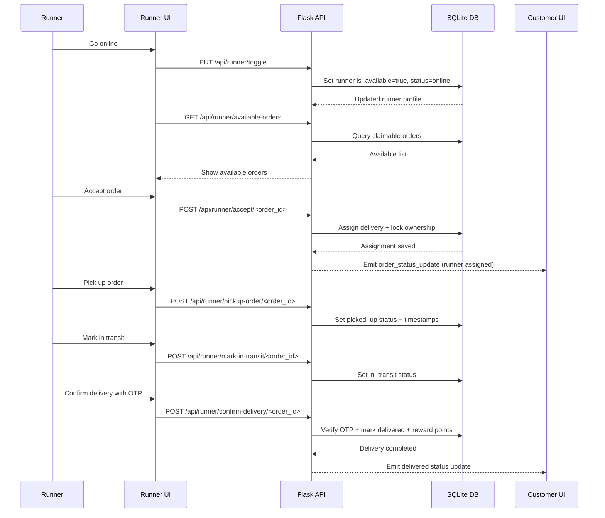

# CampusRunner

A full-stack, real-time campus canteen ordering and delivery platform built for RV University.

CampusRunner supports the complete lifecycle:

- user onboarding and email verification
- menu browsing and cart checkout
- online payment and COD
- live order updates and notifications
- student-runner delivery assignment and OTP handoff
- rewards and reviews
- staff/admin operations and reporting


---

## Table of Contents

- [1. Repository Overview](#1-repository-overview)
- [2. Key Product Capabilities](#2-key-product-capabilities)
- [3. End-to-End Architecture](#3-end-to-end-architecture)
- [4. Technology Stack](#4-technology-stack)
- [5. Repository Structure](#5-repository-structure)
- [6. Frontend Architecture](#6-frontend-architecture)
- [7. Backend Architecture](#7-backend-architecture)
- [8. API Catalog](#8-api-catalog)
- [9. Socket.IO Events and Real-Time Model](#9-socketio-events-and-real-time-model)
- [10. Data and Startup Behavior](#10-data-and-startup-behavior)
- [11. Environment Variables](#11-environment-variables)
- [12. Local Development Setup](#12-local-development-setup)
- [13. Scripts and Makefile Commands](#13-scripts-and-makefile-commands)
- [14. Testing Strategy and Coverage](#14-testing-strategy-and-coverage)
- [15. Docker and Runtime Topology](#15-docker-and-runtime-topology)
- [16. CI/CD and Security Workflows](#16-cicd-and-security-workflows)
- [17. GitHub Repository Governance](#17-github-repository-governance)
- [18. Troubleshooting Guide](#18-troubleshooting-guide)
- [19. Agile Delivery Notes](#19-agile-delivery-notes)
- [20. Contributing](#20-contributing)
- [21. Order and Runner Lifecycle Sequence Diagrams](#21-order-and-runner-lifecycle-sequence-diagrams)
- [22. API Request and Response Examples](#22-api-request-and-response-examples)
- [23. Demo and Screenshots](#23-demo-and-screenshots)
- [24. License](#24-license)

---

## 1. Repository Overview

CampusRunner is a monorepo containing:

- React + TypeScript frontend (Vite)
- Flask backend API with JWT auth and SQLAlchemy models
- Real-time messaging through Flask-SocketIO and socket.io client
- SQLite persistence by default (production DB can be swapped via `DATABASE_URL`)
- Dockerized deployment with Nginx reverse proxy
- CI/CD pipelines for linting, tests, coverage, image builds, and security scans

Primary user personas:

- Customer: browse menu, place orders, track delivery, submit reviews
- Runner: claim/accept deliveries, update delivery state, earn points
- Staff/Admin: manage orders/users/inventory, assign runners, run sales/report views

---

## 2. Key Product Capabilities

| Area | Detailed Capabilities |
|---|---|
| Auth and Identity | Email signup/login, OTP verification, password reset OTP, JWT session flows, profile update, password change |
| Ordering | Cart CRUD, checkout validation and confirmation, order creation, timeline tracking, cancellation with payment status handling |
| Delivery | Runner registration, runner availability management, claim/accept delivery flows, pickup and delivery OTP verification, delivery state transitions |
| Payments | COD, UPI, card flows, payment verification endpoint, payment history, admin refund endpoint, saved payment methods |
| Engagement | Notification center, reward points, daily bonus, vouchers/redeem flows, food review submission and fetch |
| Admin/Staff Ops | Dashboard stats, order listing and status transitions, runner assignment, user role management, inventory toggles, sales reports |
| Real-Time UX | User rooms, online runner rooms, order status updates, notification delivery hooks |
| DevOps | Docker Compose (dev/prod), health checks, GH Actions CI/CD, Trivy, CodeQL, Dependabot |

---

## 3. End-to-End Architecture



---

## 4. Technology Stack

### Frontend

- React 18.3.1
- TypeScript 5.x
- Vite 6.3.5
- React Router 7
- Tailwind CSS 4
- Radix UI primitives + shadcn/ui patterns
- Recharts and supporting UI libraries
- Vitest + Testing Library

### Backend

- Flask 2.3.3
- Flask-SQLAlchemy 3.1.1 + SQLAlchemy 2.0
- Flask-JWT-Extended 4.5.3
- Flask-CORS 4.0.0
- Flask-SocketIO 5.3.6
- Flask-Mail 0.9.1
- Flask-Limiter 3.5.0
- Gunicorn + Eventlet

### DevOps and Security

- Docker + Docker Compose
- Nginx reverse proxy and SPA static hosting
- GitHub Actions
- CodeQL analysis
- Trivy vulnerability scanning
- Dependabot updates

---

## 5. Repository Structure

```text
Campus_Runner/
  backend/
    app.py
    create_admin.py
    fix_db.py
    init_db.py
    seed.py
    socketio_events.py
    utils.py
    requirements.txt
    models/
      __init__.py
      cart.py
      checkout.py
      delivery.py
      food.py
      notification.py
      order.py
      otp.py
      payment.py
      review.py
      reward_points.py
      runner.py
      saved_payment_method.py
      token.py
      user.py
    routes/
      auth_routes.py
      cart_routes.py
      checkout_routes.py
      menu_routes.py
      notification_routes.py
      order_routes.py
      payment_methods_routes.py
      payment_routes.py
      review_routes.py
      rewards_routes.py
      runner_routes.py
      staff_admin_routes.py
    services/
      notification_service.py
      payment_service.py
    tests/
      conftest.py
      test_admin.py
      test_auth.py
      test_cart_checkout_orders.py
      test_menu_and_reviews.py
      test_orders_and_notifications.py
      test_payment_methods.py
      test_rewards.py
      test_runner_and_delivery.py

  src/
    main.tsx
    app/
      App.tsx
      routes.tsx
      components/
      context/
      data/
      hooks/
      pages/
      services/
      utils/
    assets/
    styles/

  docs/
  reference/
  instance/
  public/

  .github/workflows/
    ci.yml
    codeql.yml
    security.yml

  docker-compose.yml
  docker-compose.dev.yml
  docker-compose.prod.yml
  Dockerfile.backend
  Dockerfile.frontend
  nginx.conf
  nginx-default.conf
  DEVOPS.md
  GITHUB_CONFIG.md
  Makefile
  README.md
```

---

## 6. Frontend Architecture

Routing is defined in `src/app/routes.tsx` with protected segments.

Public pages:

- `/`
- `/login`
- `/verify-email`
- `/forgot-password`

Authenticated pages:

- `/cart`
- `/checkout`
- `/runner`
- `/runner/delivery/:deliveryId`
- `/rewards`
- `/profile`
- `/orders`
- `/orders/:id/track`
- `/payment`
- `/admin`

Page inventory (from `src/app/pages`):

- `Home.tsx`
- `Login.tsx`
- `VerifyEmail.tsx`
- `ForgotPassword.tsx`
- `Cart.tsx`
- `Checkout.tsx`
- `RunnerMode.tsx`
- `RunnerDeliveryPage.tsx`
- `Orders.tsx`
- `OrderTrackingPage.tsx`
- `Payment.tsx`
- `Rewards.tsx`
- `Profile.tsx`
- `Admin.tsx`

Frontend quality gates:

- ESLint (`npm run lint`)
- TypeScript no-emit typecheck (`npm run typecheck`)
- Vitest unit/component tests (`npm test`, `npm run test:coverage`)

---

## 7. Backend Architecture

### Flask App Responsibilities (`backend/app.py`)

- loads environment configuration from project `.env` and optional backend `.env`
- configures SQLAlchemy, JWT, CORS, Mail, Socket.IO
- registers all route blueprints under `/api/*`
- performs startup schema patching for existing SQLite databases
- seeds menu and sample review data if needed
- auto-creates default admin account
- exposes health endpoint and email test endpoint

### CORS Behavior

- explicit origin allow-list from `CORS_ORIGINS`
- default local origins if env var is not provided
- handles preflight requests and rejects unknown origins

### Startup Data Behavior

On startup, the backend can:

- create missing tables (`db.create_all()`)
- run lightweight migration-style ALTER operations for legacy local DBs
- sync menu catalog and seed sample reviews
- populate a large food catalog if DB is empty
- create default admin if absent

Default admin credentials (local/dev seed path):

- email: `admin@rvu.edu.in`
- password: `admin@123`

---

## 8. API Catalog

All routes are under `/api`.

### 8.1 Auth (`/api/auth`)

- `POST /register`
- `POST /signup`
- `POST /verify-otp`
- `POST /resend-otp`
- `POST /forgot-password`
- `POST /reset-password`
- `POST /login`
- `GET /me`
- `PUT /update-profile`
- `PUT /profile`
- `PUT /change-password`
- `PUT /notification-preferences`
- `POST /logout`
- `GET /dev/otp` (dev/testing utility)

### 8.2 Menu (`/api/menu`)

- `GET /all`
- `GET /search`
- `GET /category/<category>`
- `GET /<food_id>`
- `POST /add`
- `POST /`
- `PUT /items/<food_id>`
- `PUT /<food_id>`
- `DELETE /items/<food_id>`
- `DELETE /<food_id>`

### 8.3 Cart (`/api/cart`)

- `GET /`
- `POST /add`
- `DELETE /item/<item_id>`
- `PATCH /item/<item_id>`
- `PUT /item/<item_id>`
- `DELETE /clear`
- `POST /checkout`

### 8.4 Checkout (`/api/checkout`)

- `POST /validate`
- `POST /`
- `POST /confirm`
- `POST /summary`

### 8.5 Orders (`/api/order` and alias `/api/orders`)

- `POST /create`
- `GET /my-orders`
- `GET /<order_id>`
- `POST /<order_id>/cancel`
- `POST /<order_id>/confirm`
- `PUT /<order_id>/status`
- `GET /<order_id>/track`
- `GET /<order_id>/reviewable-items`
- `POST /<order_id>/receive`
- `POST /<order_id>/start-preparation`
- `POST /<order_id>/mark-ready`

### 8.6 Runner (`/api/runner`)

- `POST /register`
- `GET /profile`
- `POST /update-location`
- `POST /toggle-availability`
- `GET /status`
- `PUT /toggle`
- `GET /available-deliveries`
- `POST /accept-delivery/<delivery_id>`
- `GET /my-deliveries`
- `POST /delivery/<delivery_id>/update-status`
- `POST /delivery/<delivery_id>/rate`
- `GET /available-orders`
- `POST /accept/<order_id>`
- `GET /order/<order_id>/details`
- `GET /delivery/<delivery_id>/details`
- `GET /active-delivery`
- `PUT /delivery/<delivery_id>/status`
- `POST /pickup-order/<order_id>`
- `POST /mark-in-transit/<order_id>`
- `POST /deliver-order/<order_id>`
- `POST /confirm-delivery/<order_id>`

### 8.7 Rewards (`/api/rewards`)

- `GET /my-points`
- `POST /redeem`
- `GET /available`
- `GET /vouchers`
- `GET /balance`
- `GET /history`
- `GET /transactions`
- `POST /claim-daily-bonus`
- `GET /redeemed-vouchers`

### 8.8 Payment (`/api/payment`)

- `POST /initiate`
- `POST /create-order`
- `POST /verify-upi`
- `POST /verify`
- `GET /history`
- `POST /refund/<payment_id>`

### 8.9 Saved Payment Methods (`/api/payment-methods`)

- `GET /`
- `POST /`
- `DELETE /<method_id>`
- `PUT /<method_id>/default`

### 8.10 Notifications (`/api/notifications`)

- `GET /`
- `PUT /<notification_id>/read`
- `PUT /read-all`

### 8.11 Reviews (`/api/reviews`)

- `POST /`
- `GET /<food_id>`

### 8.12 Admin/Staff (`/api/admin`)

- `GET /dashboard-stats`
- `GET /orders`
- `POST /order/<order_id>/assign-runner`
- `POST /order/<order_id>/mark-ready`
- `GET /users`
- `PUT /user/<user_id>/update-role`
- `GET /foods/inventory`
- `POST /food/<food_id>/toggle-availability`
- `GET /reports/sales`

### 8.13 Utility Endpoints

- `GET /` backend root metadata
- `GET /api/health` backend health check
- `POST /api/test-email` SMTP test endpoint

---

## 9. Socket.IO Events and Real-Time Model

Socket integration exists in backend app setup and `backend/socketio_events.py`.

### Rooms

- `user:<user_id>` user-specific updates
- `runners` / `runners_online` runner broadcast scopes
- `staff` admin/staff room

### Event Examples

- `connect` validates token and auto-joins rooms
- `join_user_room`
- `runner_online` / `runner_go_online`
- `runner_offline` / `runner_go_offline`
- server emits `order_status_update` to customer room when delivery state changes

Nginx proxies `/socket.io` to backend with upgrade headers enabled.

---

## 10. Data and Startup Behavior

### Persistence

- default DB: SQLite file at `instance/campusrunner.db`
- in Docker: volume-mounted at `/app/instance`

### Seed and Migration Mechanics

At startup, app logic can:

- patch missing columns in existing tables (`orders`, `foods`, `cart_items`, `order_items`, `deliveries`, `payments`, `notifications`, `reviews`, `order_otps`, `users`)
- sync menu catalog
- seed sample reviews

### Test Isolation Strategy

`backend/tests/conftest.py` uses:

- temporary SQLite DB per session
- full schema reset between tests
- stubbed email and selected external side effects
- JWT helper fixtures and data factories for users, food, runners, orders

---

## 11. Environment Variables

Base template: `.env.example`

### Core App

- `FLASK_ENV`
- `FLASK_DEBUG`
- `FLASK_APP`
- `DEBUG`
- `DATABASE_URL`
- `JWT_SECRET_KEY`
- `SECRET_KEY`

### Frontend and CORS

- `FRONTEND_URL`
- `VITE_API_URL`
- `VITE_ENVIRONMENT`
- `CORS_ORIGINS`
- `ALLOWED_EMAIL_DOMAIN`

### Mail

- `MAIL_SERVER`
- `MAIL_PORT`
- `MAIL_USE_TLS`
- `MAIL_USERNAME`
- `MAIL_PASSWORD`
- `MAIL_DEFAULT_SENDER`

### Payments

- `RAZORPAY_KEY_ID`
- `RAZORPAY_KEY_SECRET`

### Media

- `CLOUDINARY_CLOUD_NAME`
- `CLOUDINARY_API_KEY`
- `CLOUDINARY_API_SECRET`

### Optional Queue/Caching (declared template)

- `REDIS_URL`
- `CELERY_BROKER_URL`
- `CELERY_RESULT_BACKEND`

### Logging and Compose

- `LOG_LEVEL`
- `LOG_FORMAT`
- `NODE_ENV`
- `COMPOSE_PROJECT_NAME`

---

## 12. Local Development Setup

### 12.1 Manual Setup

```bash
git clone https://github.com/RachanaB5/Campus_Runner.git
cd Campus_Runner
```

Backend:

```bash
cd backend
pip install -r requirements.txt
python app.py
```

Frontend (from repo root):

```bash
npm install
npm run dev
```

Default local endpoints:

- frontend: `http://localhost:5173`
- backend: `http://localhost:5000`
- health: `http://localhost:5000/api/health`

### 12.2 One-Shot Setup Scripts

Linux/macOS:

```bash
bash setup.sh
```

Windows:

```bat
setup.bat
```

Both scripts:

- verify Node and Python
- install npm dependencies (`--legacy-peer-deps`)
- create `.venv`
- install backend requirements
- initialize DB

---

## 13. Scripts and Makefile Commands

### 13.1 `package.json` Scripts

- `npm run dev`
- `npm run build`
- `npm run lint`
- `npm run typecheck`
- `npm test`
- `npm run test:coverage`

### 13.2 Useful Makefile Targets

Development:

- `make dev`
- `make dev-logs`
- `make up`
- `make logs`
- `make stop`

Build and quality:

- `make build`
- `make build-no-cache`
- `make test-backend`
- `make test-frontend`
- `make test`
- `make lint`

Database and ops:

- `make db-init`
- `make db-seed`
- `make db-migrate`
- `make db-backup`
- `make health`
- `make status`
- `make ps`
- `make prune`

Utility:

- `make shell-backend`
- `make shell-frontend`
- `make admin-create`

---

## 14. Testing Strategy and Coverage

Backend test modules:

- `test_auth.py`
- `test_admin.py`
- `test_cart_checkout_orders.py`
- `test_menu_and_reviews.py`
- `test_orders_and_notifications.py`
- `test_payment_methods.py`
- `test_rewards.py`
- `test_runner_and_delivery.py`

Backend run:

```bash
cd backend
pytest
pytest --cov=backend --cov-report=term-missing --cov-report=xml
```

Frontend run:

```bash
npm test
npm run test:coverage
```

CI executes frontend and backend suites with coverage artifact upload.

---

## 15. Docker and Runtime Topology

### 15.1 Compose Files

- `docker-compose.yml` base services and health checks
- `docker-compose.dev.yml` dev overrides (debug, source mounts)
- `docker-compose.prod.yml` production overrides (no local volumes, always restart)

### 15.2 Services

Backend container:

- name: `campus_runner_backend`
- exposed: `5000:5000`
- health: `GET /api/health`
- persistent mount: `./instance:/app/instance`

Frontend container:

- name: `campus_runner_frontend`
- exposed: `8080:8080`
- health: `GET /health`
- Nginx serves static app and proxies `/api/*` and `/socket.io`

Network:

- bridge network `campus_runner_network`

### 15.3 Docker Commands

Development:

```bash
docker compose -f docker-compose.yml -f docker-compose.dev.yml up --build
```

Production:

```bash
docker compose -f docker-compose.yml -f docker-compose.prod.yml up --build -d
```

Default:

```bash
docker compose up --build
```

Containerized URLs:

- frontend via Nginx: `http://localhost:8080`
- backend API: `http://localhost:5000`
- frontend health: `http://localhost:8080/health`

---

## 16. CI/CD and Security Workflows

Workflow files:

- `.github/workflows/ci.yml`
- `.github/workflows/codeql.yml`
- `.github/workflows/security.yml`

### `ci.yml`

Includes jobs for:

- backend matrix testing (Python 3.11 + 3.12)
- frontend setup, lint, typecheck, tests, build
- Docker image build and GHCR push on push to main/develop/feature/fix branches
- Trivy SARIF scanning
- deployment-ready summary job on `main`

### `codeql.yml`

- push and PR on `main`/`develop`
- weekly schedule
- language matrix: Python and JavaScript

### `security.yml`

- npm audit (high)
- pip-audit (high)
- push on main/master + weekly schedule
- configured as continue-on-error for visibility without hard-stop

---

## 17. GitHub Repository Governance

Supporting docs:

- `GITHUB_CONFIG.md`
- `DEVOPS.md`

Configured and recommended controls include:

- Dependabot updates
- CODEOWNERS review ownership
- branch protection (required checks + required reviews)
- CodeQL and security scan checks
- secrets management in Actions settings
- optional deployment environments (`staging`, `production`)

---

## 18. Troubleshooting Guide

### API unreachable in Docker

- verify backend container health: `docker compose ps`
- inspect logs: `docker compose logs -f backend`

### Frontend requests fail due to CORS

- set `CORS_ORIGINS` to include exact frontend origin
- recreate backend container to apply env changes

### Env updates not applied

- `docker compose restart` may not re-read `.env`
- recreate service: `docker compose up -d backend`

### SMTP email not sending

- validate mail variables in `.env`
- use app endpoint: `POST /api/test-email`
- for Gmail, use app password and TLS settings

### Payment verification confusion in dev

- payment service currently uses mock-friendly behavior for local flow
- keep keys and verification paths aligned with your target environment

### Database reset during local dev

- stop app
- delete `instance/campusrunner.db`
- restart backend to recreate tables and seed defaults

---

## 19. Agile Delivery Notes

The project was delivered in iterative sprint style:

- Sprint 1: auth, verification, menu browsing, cart, initial order placement
- Sprint 2: payment modes, tokenized order flow, runner mode, OTP handoff, rewards

Definition of Done used:

- implemented in backend and frontend
- persisted and validated in DB
- integrated end-to-end
- tested and reviewed
- no critical open defects

---

## 20. Contributing

1. Fork repository.
2. Create branch using one of:
   - `feature/<name>`
   - `fix/<name>`
   - `chore/<name>`
   - `docs/<name>`
3. Run quality checks before PR:
   - backend tests
   - frontend lint/typecheck/tests
4. Open pull request into `main`.

Recommended before PR:

```bash
npm run lint
npm run typecheck
npm run test
cd backend && pytest
```

---

## 21. Order and Runner Lifecycle Sequence Diagrams

### 21.1 Customer Order Lifecycle



### 21.2 Runner Delivery Lifecycle



---

## 22. API Request and Response Examples

### 22.1 Register User

Request:

```http
POST /api/auth/register
Content-Type: application/json

{
  "name": "Aarav Sharma",
  "email": "aarav@rvu.edu.in",
  "phone": "9876543210",
  "password": "securePass123"
}
```

Response (201):

```json
{
  "message": "User registered successfully. Check your email for the verification code.",
  "requires_verification": true,
  "email_sent": true,
  "user": {
    "id": "uuid",
    "name": "Aarav Sharma",
    "email": "aarav@rvu.edu.in",
    "role": "customer"
  }
}
```

### 22.2 Login

Request:

```http
POST /api/auth/login
Content-Type: application/json

{
  "email": "aarav@rvu.edu.in",
  "password": "securePass123"
}
```

Response (200):

```json
{
  "message": "Login successful",
  "access_token": "jwt-token",
  "user": {
    "id": "uuid",
    "email": "aarav@rvu.edu.in",
    "role": "customer"
  }
}
```

### 22.3 Checkout Confirm

Request:

```http
POST /api/checkout/confirm
Authorization: Bearer <token>
Content-Type: application/json

{
  "delivery_address": "Hostel A, Room 101, Near Block A",
  "customer_phone": "9876543210",
  "payment_method": "upi"
}
```

Response (201/200):

```json
{
  "message": "Order created successfully",
  "order": {
    "id": "order-uuid",
    "order_number": "ORD-20260416-ABCD",
    "status": "pending",
    "total_amount": 210.0
  }
}
```

### 22.4 Initiate UPI Payment

Request:

```http
POST /api/payment/initiate
Authorization: Bearer <token>
Content-Type: application/json

{
  "order_id": "order-uuid",
  "method": "upi",
  "upi_id": "user@upi"
}
```

Response (200):

```json
{
  "success": true,
  "method": "upi",
  "razorpay_order_id": "order_mock_xxx",
  "razorpay_key_id": "rzp_test_xxx",
  "mock_checkout": true
}
```

### 22.5 Runner Accept Order

Request:

```http
POST /api/runner/accept/<order_id>
Authorization: Bearer <runner-token>
```

Response (200):

```json
{
  "message": "Order accepted successfully",
  "delivery": {
    "status": "assigned"
  }
}
```

Note: exact response fields can vary by endpoint evolution; use these examples as integration templates.

---

## 23. Demo and Screenshots


### 23.3 Repository Folder Convention

Store media under:

```text
docs/screenshots/
docs/demo/
```

Suggested filenames:

- `docs/screenshots/login.png`
- `docs/screenshots/menu.png`
- `docs/screenshots/checkout.png`
- `docs/screenshots/order-tracking.png`
- `docs/screenshots/runner-mode.png`
- `docs/screenshots/admin-dashboard.png`
- `docs/demo/campusrunner-walkthrough.gif`

### 23.3 README Embed Template

```md
## Product Screens


## Demo


```

---

## 24. License

MIT
