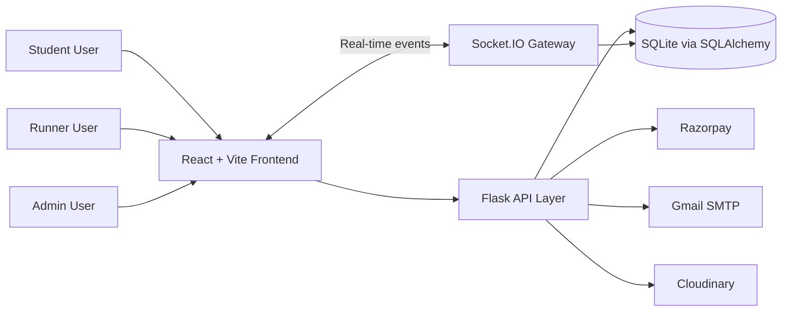

# CampusRunner

A production-style, real-time campus canteen ordering and delivery platform.

CampusRunner helps students browse food, place orders, pay securely, track progress live, and optionally switch into Runner Mode to deliver orders and earn reward points.


---

## Why This Repo Stands Out

- Real-time order and notification updates through Socket.IO
- Runner workflow with claim, pickup, delivery, and OTP verification
- FCFS-safe order claiming with backend race-condition protection
- Mixed payment support: Razorpay and COD
- Reward point ledger with tier progression
- Admin operations for users, menu, orders, and analytics
- Full-stack test coverage with CI/CD, security scans, and Docker support

---

## Core Features

| Domain | Capabilities |
|---|---|
| Authentication | Email-domain restricted signup, OTP verification, JWT auth, password reset |
| Menu and Cart | Browse food, add/update/remove cart items, checkout pipeline |
| Orders | Live order state, cancellation handling, public active-order board |
| Runner Mode | Toggle runner availability, claim orders, update delivery state, OTP confirmation |
| Payments | COD and online payment initiation/verification, saved payment methods |
| Notifications | Real-time bell notifications and persistent DB-backed notification history |
| Reviews | Post-order ratings and food reviews |
| Rewards | Points earning, tiering, and transaction history |
| Admin | Menu CRUD, order status control, user management, analytics |

---

## System Snapshot



---

## Tech Stack

| Layer | Technologies |
|---|---|
| Frontend | React 18.3.1, TypeScript, Vite 6.3.5, Tailwind CSS 4, Radix UI, shadcn/ui |
| Backend | Flask 2.3.3, Flask-SQLAlchemy, Flask-JWT-Extended, Flask-SocketIO |
| Database | SQLite + SQLAlchemy 2.0 |
| Realtime | Socket.IO (server + client) |
| Payments | Razorpay (plus COD flow) |
| Notifications | Flask-Mail (SMTP) + in-app notification service |
| Testing | Pytest, pytest-cov, Vitest, Testing Library |
| Quality and Security | ESLint, TypeScript checks, CodeQL, Trivy |
| Infra | Docker, Docker Compose, Nginx, Gunicorn, Eventlet |

---

## Project Layout

```text
Campus_Runner/
  backend/
    models/
    routes/
    services/
    tests/
    app.py
    requirements.txt
  src/
    app/
      components/
      context/
      hooks/
      pages/
      services/
      utils/
    styles/
    main.tsx
  docs/
  reference/
  docker-compose.yml
  docker-compose.dev.yml
  docker-compose.prod.yml
  Dockerfile.backend
  Dockerfile.frontend
  README.md
```

---

## Quick Start (Local)

### Prerequisites

- Python 3.11+
- Node.js 20+
- npm
- Git

### 1. Clone

```bash
git clone <your-repo-url>
cd Campus_Runner
```

### 2. Backend Setup

```bash
cd backend
pip install -r requirements.txt
python app.py
```

Backend runs on `http://localhost:5000`.

### 3. Frontend Setup

```bash
# from repository root
npm install
npm run dev
```

Frontend runs on `http://localhost:5173`.

---

## Environment Configuration

Create a `.env` file and configure at least the following values:

- `SECRET_KEY`
- `JWT_SECRET_KEY`
- `DATABASE_URL`
- `FRONTEND_URL`
- `VITE_API_URL`

Optional integrations:

- Razorpay: `RAZORPAY_KEY_ID`, `RAZORPAY_KEY_SECRET`
- Gmail SMTP: `MAIL_SERVER`, `MAIL_PORT`, `MAIL_USERNAME`, `MAIL_PASSWORD`, `MAIL_DEFAULT_SENDER`
- Cloudinary: `CLOUDINARY_CLOUD_NAME`, `CLOUDINARY_API_KEY`, `CLOUDINARY_API_SECRET`

---

## API Surface (High-Level)

All API routes are prefixed with `/api`.

| Module | Base Path |
|---|---|
| Auth | `/api/auth` |
| Menu | `/api/menu` |
| Cart | `/api/cart` |
| Checkout | `/api/checkout` |
| Orders | `/api/order` |
| Payments | `/api/payment` |
| Payment Methods | `/api/payment-methods` |
| Runner | `/api/runner` |
| Rewards | `/api/rewards` |
| Notifications | `/api/notifications` |
| Reviews | `/api/reviews` |
| Admin | `/api/admin` |
| Health | `/api/health` |

---

## Scripts and Commands

### Frontend

```bash
npm run dev
npm run build
npm run lint
npm run typecheck
npm test
npm run test:coverage
```

### Backend

```bash
cd backend
pytest
pytest --cov=backend --cov-report=term-missing --cov-report=xml
```

---

## Docker Workflows

### Development Compose

```bash
docker compose -f docker-compose.yml -f docker-compose.dev.yml up --build
```

### Production Compose

```bash
docker compose -f docker-compose.yml -f docker-compose.prod.yml up --build -d
```

### Default Compose

```bash
docker compose up --build
```

---

## CI/CD and Security

The repository includes GitHub Actions workflows for:

- Backend lint and test validation
- Frontend lint, typecheck, test, and build validation
- Code coverage publishing
- Docker image build and push flows
- CodeQL static analysis
- Trivy vulnerability scanning
- Dependabot dependency update automation

See `DEVOPS.md` for detailed delivery pipeline behavior.

---

## Agile Delivery Notes

The project was delivered in sprint-style increments:

- Sprint 1: auth, verification, menu, cart, basic ordering
- Sprint 2: payments, tokens, FCFS queue safety, runner mode, OTP handoff, rewards

Definition of Done:

- Implemented and persisted
- UI integrated end-to-end
- Core tests passing
- No critical known defects

---

## Contributing

1. Fork the repository.
2. Create a branch: `feature/<name>`, `fix/<name>`, `chore/<name>`, or `docs/<name>`.
3. Commit with clear messages.
4. Push and open a pull request to `main`.

---

## License

MIT
