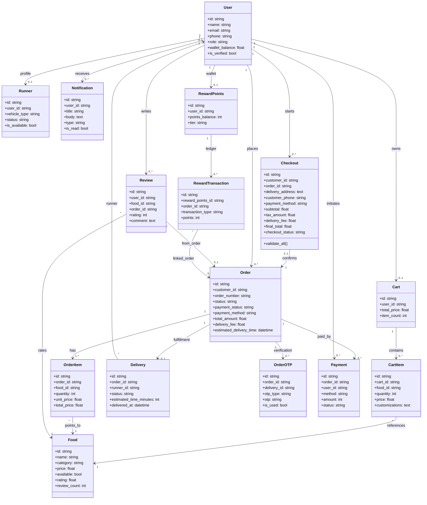
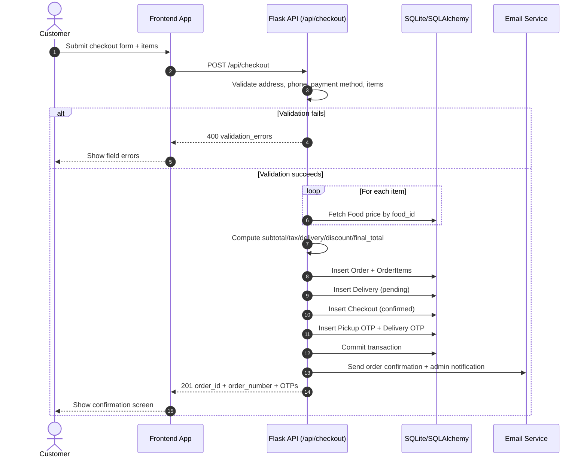
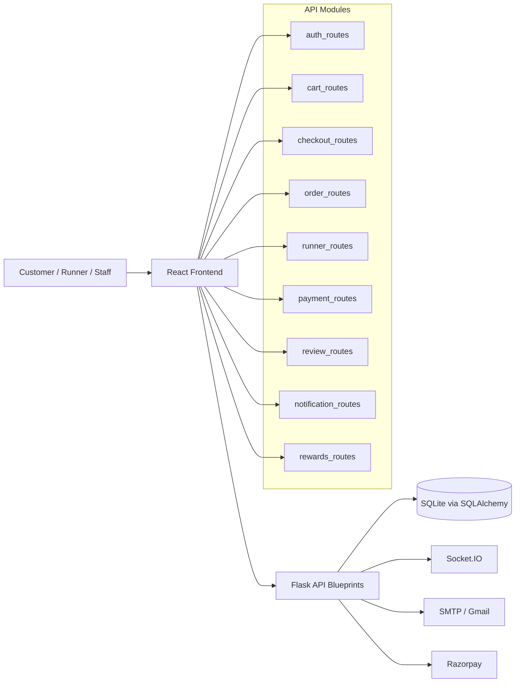

# Campus Runner Architecture Diagrams

This document contains Mermaid diagrams for core backend domain modeling and request flows.

## 1) Domain Class Diagram (Backend Models)



## 2) Sequence Diagram: Checkout to Order Creation



## 3) Sequence Diagram: Payment Initiation and Confirmation

```mermaid
sequenceDiagram
    autonumber
    actor Customer
    participant FE as Frontend App
    participant PayAPI as Flask API (/api/payment)
    participant DB as SQLite/SQLAlchemy
    participant PSP as Razorpay (or Mock)

    Customer->>FE: Choose payment method (cod/upi/card)
    FE->>PayAPI: POST /api/payment/initiate
    PayAPI->>DB: Validate user + order ownership + order state
    PayAPI->>DB: Check payment attempt rate limit

    alt COD
      PayAPI->>DB: Create Payment(status=pending)
      PayAPI->>DB: Update Order(status=confirmed, payment_status=cod_pending)
      PayAPI-->>FE: COD accepted
    else UPI
      PayAPI->>PSP: Create order (or mock)
      PayAPI->>DB: Create Payment(status=pending, razorpay_order_id)
      PayAPI-->>FE: return key_id + order_id
      FE->>PSP: Complete checkout
      FE->>PayAPI: POST /api/payment/verify
      PayAPI->>PSP: Verify signature
      PayAPI->>DB: Mark Payment success; Order paid/confirmed
      PayAPI-->>FE: Payment verified
    else CARD
      PayAPI->>PayAPI: Validate Luhn + expiry + PIN format
      PayAPI->>DB: Create Payment(status=success)
      PayAPI->>DB: Update Order(status=confirmed, payment_status=paid)
      PayAPI-->>FE: Card payment success
    end
```

## 4) High-Level Service Interaction Diagram



## Notes

- Diagrams are based on the current backend model and route flow.
- Update this file whenever model relationships or key endpoints change.
